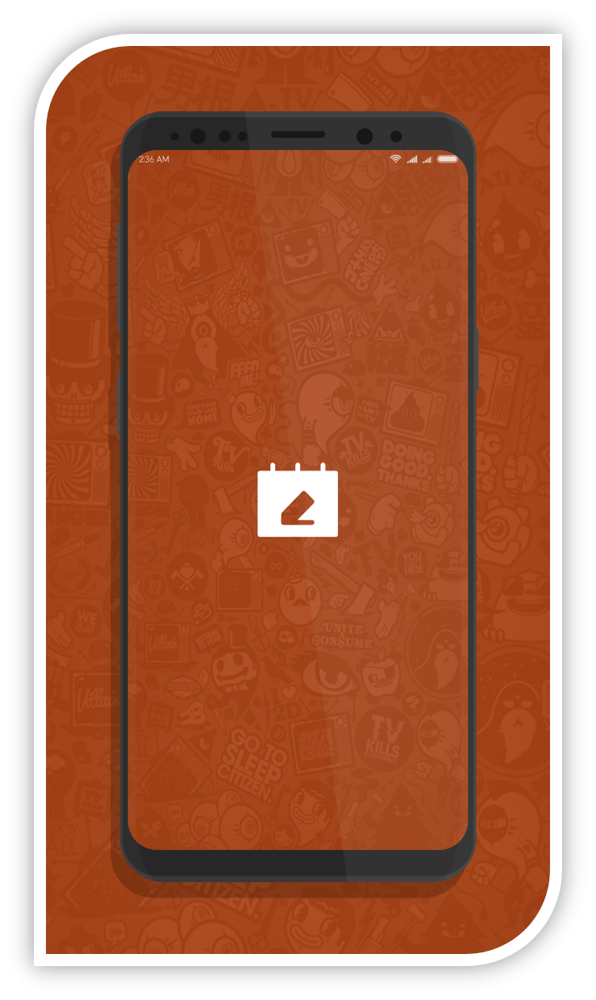
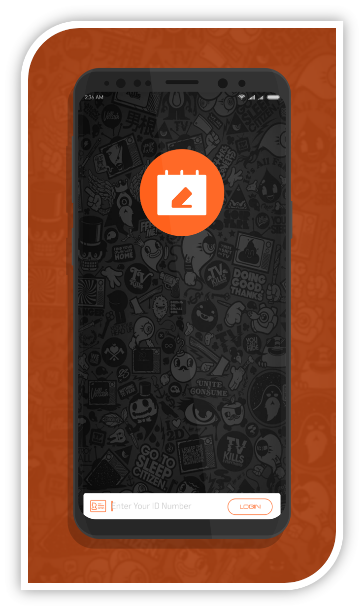
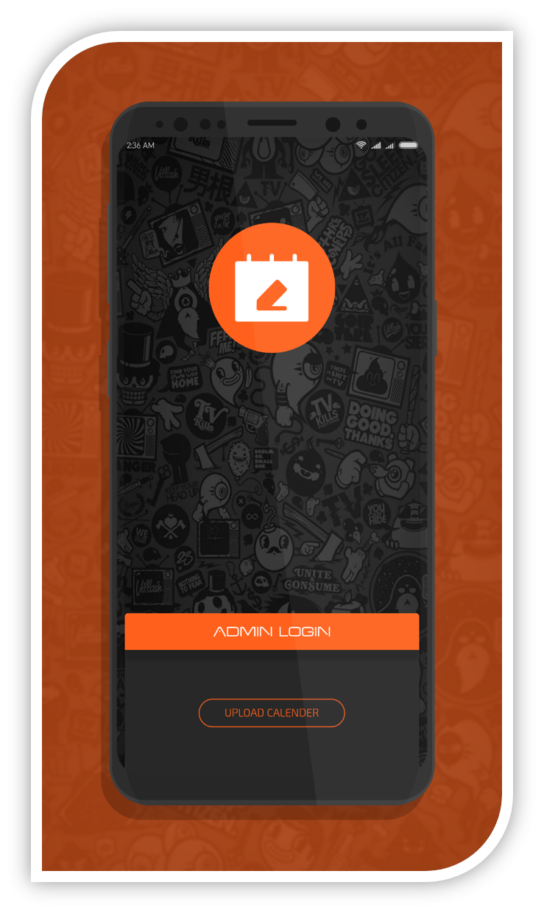
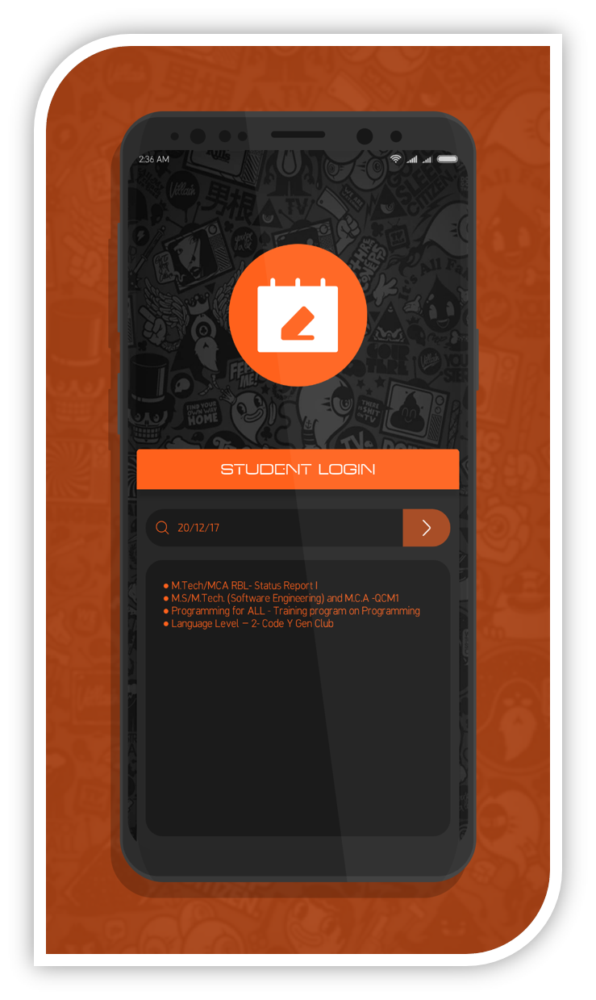
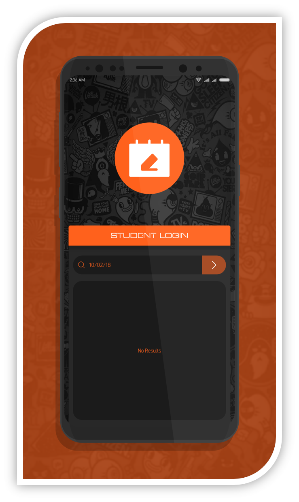

# Academic Calendar
**Academic Calendar** mobile application is fabricated for universities to distribute academics related schedules and activities among students in an **organised manner**. This application is fully independent as it uses online database to share its dataset. **Firebase** is used as online database in this app.

**It consist of two login portals :**  
    ●  Faculty Login  
    ●  Student Login

### Faculty Login
Faculty can login just by entering their **Faculty ID**. After logging in **Faculty Portal** will be displayed, where user can select any unformatted pdf/doc file. After selecting an appropriate doccument file, application will process the file and upload a packed dataset on online database. User can now logout.  

### Student Login
Students can login just by entering their **Registration Number**. After logging in **Student portal** will be displayed. Application then fetches the latest dataset from online database. After fetching finishes, application displays a searchbar which can be used to enter a valid date, and application will display all events on corresponding date.  

## Features
- Uses firebase database which is fast and secure.
- Dark Elegant User Interface with orange accent and lots of animation.
-	Different login (faculty/student) is recognised using Regex.
- Uploads a processed dataset instead of file for quick fetching.

## Template
Academic calender document must be of similar format as represented in [here](calendar.pdf?raw=true)

## Screenshots

## Download  
This **Academic Calendar** mobile application is packed with lot of features and ideal for any organisation. Get you hands on it down below for free.  

